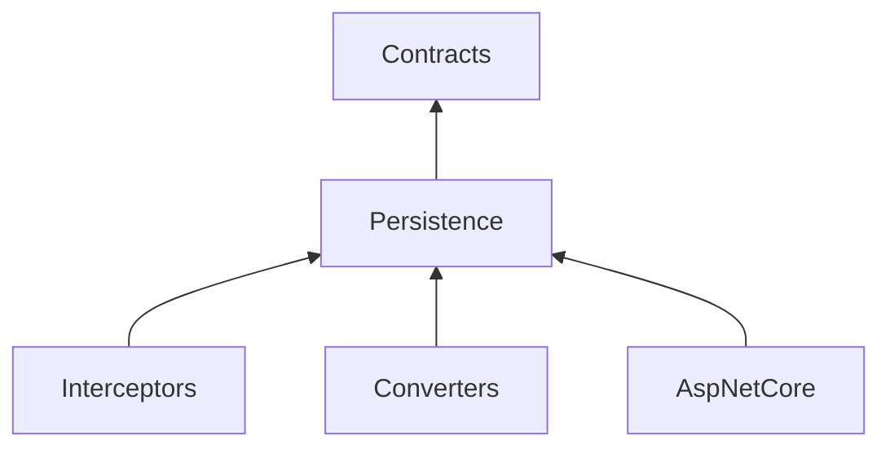

# Configuration.Persistence

[](https://dev.azure.com/kritikos/DotNet%20Libaries/_build/latest?definitionId=14&repoName=kritikos-io%2FConfiguration.Persistence&branchName=main)
[](https://codecov.io/gh/kritikos-io/Configuration.Persistence)
[](https://coveralls.io/github/kritikos-io/Configuration.Persistence?branch=main)
[](https://sonarcloud.io/dashboard?id=kritikos-io_Configuration.Persistence)
[](https://opensource.org/licenses/Apache-2.0)


A starting point and a set of composable extensions for database persistence with [Entity Framework Core][efcore].

## Packages

| Package | Description |
| --- | --- |
| `Kritikos.Configuration.Persistence.Contracts` | Dependency-free interfaces describing entities, timestamps, auditing and soft deletion. See [the project README](src/Configuration.Persistence.Contracts/README.md). |
| `Kritikos.Configuration.Persistence` | Model-building extensions, concurrency contracts and the audit trail entity. See [the project README](src/Configuration.Persistence/README.md). |
| `Kritikos.Configuration.Persistence.Interceptors` | `SaveChanges` interceptors implementing the behaviours the contracts describe. See [the project README](src/Configuration.Persistence.Interceptors/README.md). |
| `Kritikos.Configuration.Persistence.Converters` | `ValueConverter` implementations for types EF Core does not map out of the box. See [the project README](src/Configuration.Persistence.Converters/README.md). |
| `Kritikos.Configuration.Persistence.AspNetCore` | Host and options wiring for ASP.NET Core applications. See [the project README](src/Configuration.Persistence.AspNetCore/README.md). |



Only `Contracts` is free of an Entity Framework Core dependency, which makes it the package to reference from projects that describe models but never touch a database — DTO assemblies, shared client libraries or domain projects.

## Getting Started

Reference the packages you actually need; each one transitively brings in the ones below it.

```shell
dotnet add package Kritikos.Configuration.Persistence.Interceptors
dotnet add package Kritikos.Configuration.Persistence.AspNetCore
```

Mark entities with the behavioural interfaces, register the matching interceptors, then apply the model conventions in `OnModelCreating`.

```csharp
public class Person : IEntity<long>, ITimestamped, ISoftDeletable
{
  public long Id { get; set; }
  public DateTime CreatedAt { get; set; }
  public DateTime UpdatedAt { get; set; }
  public bool IsDeleted { get; set; }
  public DateTime? DeletedAt { get; set; }
}
```

```csharp
builder.Services.AddDbContext<AppDbContext>(options => options
  .UseNpgsql(connectionString)
  .EnableCommonOptions(builder.Environment)
  .AddInterceptors(
    new TimestampSaveChangesInterceptor(),
    new SoftDeleteSaveChangesInterceptor()));
```

```csharp
protected override void OnModelCreating(ModelBuilder builder)
{
  base.OnModelCreating(builder);
  builder.ApplyConcurrencyTokens();
  builder.ApplySoftDeletableFilters();
}
```

A complete, migration-backed example lives in [`samples/Samples.CityCensus`](samples/Samples.CityCensus).

## Building and Testing

The solution file is [`Configuration.Persistence.slnx`](Configuration.Persistence.slnx); pass it explicitly so every project is included.

```shell
dotnet build Configuration.Persistence.slnx
dotnet test Configuration.Persistence.slnx
```

Tests run on [TUnit] over the Microsoft Testing Platform, which `global.json` selects as the test runner.

> [!IMPORTANT]
> The Microsoft Testing Platform forwards unrecognised arguments to the test host rather than rejecting them, so a stray flag surfaces as a handshake failure and zero discovered tests. Use `--treenode-filter` in place of VSTest's `--filter`.

## Docker

A multi-stage Dockerfile is provided in `docker/` with multiple targets for different use cases. Sample usage is provided in [`compose.sample.yaml`](docker/compose.sample.yaml).

The `RUNTIME_BASE` build arg controls the final image base:

| Value | Base image | Use case |
| --- | --- | --- |
| `web` (default) | `aspnet` | ASP.NET web applications |
| `app` | `runtime` | Console applications |
| `self-contained` | `runtime-deps` | Self-contained deployments |

## OpenAPI Linting

OpenAPI documents generated at build time are validated using [Spectral]. Configure rules in `.spectral.yaml` at the repository root.

[efcore]: https://learn.microsoft.com/en-us/ef/core/
[Spectral]: https://github.com/stoplightio/spectral
[TUnit]: https://tunit.dev/
