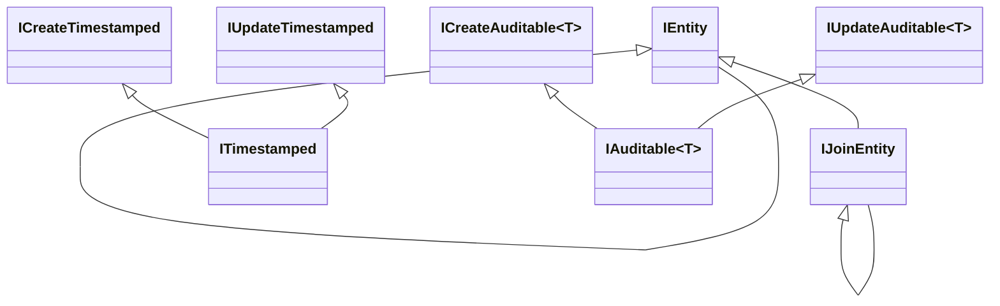

# Configuration.Persistence.Contracts

A dependency-free set of interfaces describing how an entity behaves, so that persistence concerns can be applied by convention rather than by hand.

## Getting Started

```shell
dotnet add package Kritikos.Configuration.Persistence.Contracts
```

This package references nothing outside the base class library. Reference it from DTO assemblies, shared client libraries and domain projects that describe models but must not take a dependency on Entity Framework Core; the rest of the family builds on top of it.

## Capabilities

Every interface is a pure contract. Behaviour comes from [`Kritikos.Configuration.Persistence`](../Configuration.Persistence/README.md) at model-building time and from [`Kritikos.Configuration.Persistence.Interceptors`](../Configuration.Persistence.Interceptors/README.md) at save time.

| Interface | Members | Purpose |
| --- | --- | --- |
| `IEntity` | — | Marker grouping every persisted entity |
| `IEntity<TKey>` | `Id` | An entity with a single primary key of type `TKey` |
| `IJoinEntity` | — | Marker identifying junction tables |
| `IJoinEntity<TLeft, TRight>` | — | A junction table between two entities |
| `IJoinEntity<TLeft, TKeyLeft, TRight, TKeyRight>` | — | The same, with both key types known |
| `ICreateTimestamped` | `CreatedAt` | UTC creation time |
| `IUpdateTimestamped` | `UpdatedAt` | UTC time of last update |
| `ITimestamped` | both of the above | The common case for timestamping |
| `ICreateAuditable<T>` | `CreatedBy` | The principal that created the entity |
| `IUpdateAuditable<T>` | `UpdatedBy` | The principal that last updated the entity |
| `IAuditable<T>` | both of the above | The common case for attribution |
| `ITraceableAudit` | — | Opts the entity into a full audit trail |
| `ISoftDeletable` | `IsDeleted`, `DeletedAt` | Deletions become updates and stay recoverable |



Splitting the create and update halves matters for append-only tables: an entity that is written once and never modified should implement `ICreateTimestamped` alone, so no interceptor ever stamps a meaningless `UpdatedAt`.

## Usage Examples

Implementing the interfaces is the whole of the API surface.

```csharp
public class Person : IEntity<long>, ITimestamped, IAuditable<Guid>, ISoftDeletable
{
  public long Id { get; set; }
  public string Name { get; set; } = string.Empty;

  public DateTime CreatedAt { get; set; }
  public DateTime UpdatedAt { get; set; }
  public Guid CreatedBy { get; set; }
  public Guid UpdatedBy { get; set; }
  public bool IsDeleted { get; set; }
  public DateTime? DeletedAt { get; set; }
}
```

`Model<TKey>` is an abstract base for DTOs that need identity-based equality, which keeps comparisons meaningful after a round trip to the server.

```csharp
public class PersonDto : Model<long>
{
  public string Name { get; set; } = string.Empty;
}
```

`IJoinEntity<TLeft, TRight>` marks the entity behind a many-to-many relationship and is what `ManyToManyWithJoinEntity` and `ManyToManyWithSkipNavigation` bind against.

```csharp
public class PersonCorporation : IJoinEntity<Person, long, Corporation, Guid>
{
  public Person Person { get; set; } = null!;
  public Corporation Corporation { get; set; } = null!;
}
```

## Caveats

> [!IMPORTANT]
> These interfaces describe intent only. Implementing `ITimestamped` does not populate `CreatedAt`; register `TimestampSaveChangesInterceptor` for that. Implementing `ISoftDeletable` does not filter deleted rows out of queries; call `ApplySoftDeletableFilters` in `OnModelCreating` for that.

> [!NOTE]
> `TKey` is constrained to `IComparable<TKey>` and `IEquatable<TKey>`, which admits the usual `int`, `long` and `Guid` keys but rules out composite keys. Configure those manually.
