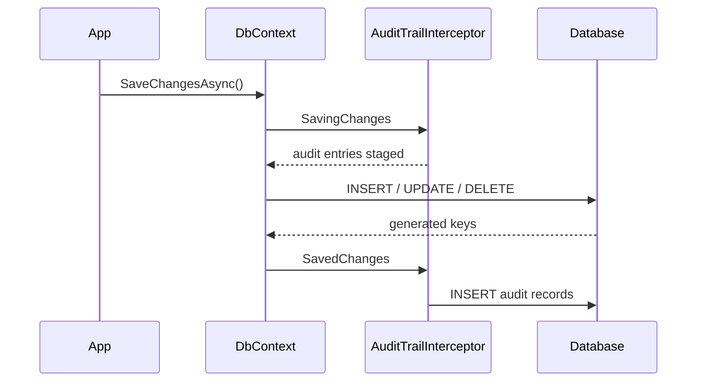

# Configuration.Persistence.Interceptors

`SaveChanges` interceptors implementing the behaviour the entity contracts describe, so timestamping, attribution, soft deletion and audit trails happen without a line of code in your repositories.

## Getting Started

```shell
dotnet add package Kritikos.Configuration.Persistence.Interceptors
```

Interceptors are registered on the `DbContextOptionsBuilder` and apply to every entity the context tracks.

```csharp
builder.Services.AddDbContext<AppDbContext>(options => options
  .UseNpgsql(connectionString)
  .AddInterceptors(
    new TimestampSaveChangesInterceptor(),
    new SoftDeleteSaveChangesInterceptor()));
```

## Capabilities

| Interceptor | Acts on | Behaviour |
| --- | --- | --- |
| `TimestampSaveChangesInterceptor` | `ICreateTimestamped`, `IUpdateTimestamped` | Stamps `CreatedAt` on insert and `UpdatedAt` on insert and update |
| `AuditSaveChangesInterceptor<T>` | `ICreateAuditable<T>`, `IUpdateAuditable<T>` | Stamps `CreatedBy` and `UpdatedBy` from an `IAuditorProvider<T>` |
| `AuditTrailSaveChangesInterceptor<TAuditRecord, TContext>` | `ITraceableAudit` | Writes an `AuditRecord` per changed entity, capturing old and new values as JSON |
| `SoftDeleteSaveChangesInterceptor` | `ISoftDeletable` | Rewrites deletions into updates setting `IsDeleted` and `DeletedAt` |
| `ReadOnlyDbSaveChangesInterceptor` | the whole context | Suppresses every save, reporting zero affected rows |

The audit trail is the only interceptor that writes twice: entries are staged while changes are being saved, because the primary keys of inserted entities are not known until the database has assigned them, then flushed once the original save completes.



## Configuration

`AuditSaveChangesInterceptor<T>` needs an `IAuditorProvider<T>` to answer "who is making this change". `TryGetAuditor` reports whether a principal could be resolved; `GetFallbackAuditor` supplies the identity that background and system work is attributed to.

```csharp
public class HttpAuditorProvider(IHttpContextAccessor accessor) : IAuditorProvider<Guid>
{
  public bool TryGetAuditor(out Guid auditor)
    => Guid.TryParse(accessor.HttpContext?.User.FindFirstValue(ClaimTypes.NameIdentifier), out auditor);

  public Guid GetFallbackAuditor() => Guid.Empty;
}
```

The provider is usually scoped to a request, so resolve the interceptor from the service provider rather than constructing it inline.

```csharp
builder.Services.AddScoped<IAuditorProvider<Guid>, HttpAuditorProvider>();
builder.Services.AddScoped<AuditSaveChangesInterceptor<Guid>>();

builder.Services.AddDbContext<AppDbContext>((provider, options) => options
  .UseNpgsql(connectionString)
  .AddInterceptors(provider.GetRequiredService<AuditSaveChangesInterceptor<Guid>>()));
```

`AuditTrailSaveChangesInterceptor<TAuditRecord, TContext>` takes two optional arguments: `recordUnchangedProperties` chooses between a full snapshot and a delta, and `serializerOptions` customises how values are serialised. Passing a `TContext` to the constructor sends the trail to a different context than the one being audited.

```csharp
options.AddInterceptors(
  new AuditTrailSaveChangesInterceptor<AuditRecord, AppDbContext>(recordUnchangedProperties: false));
```

`TimestampSaveChangesInterceptor`, `SoftDeleteSaveChangesInterceptor` and `AuditTrailSaveChangesInterceptor<TAuditRecord, TContext>` each accept an optional `TimeProvider`, defaulting to `TimeProvider.System`. Passing the same instance to all three keeps an audit record and the entity it describes on a single instant, and lets tests drive the clock instead of asserting on ranges, whether through `FakeTimeProvider` from [`Microsoft.Extensions.TimeProvider.Testing`][time-testing] or a `TimeProvider` of your own.

```csharp
var clock = new FakeTimeProvider();

options.AddInterceptors(
  new TimestampSaveChangesInterceptor(clock),
  new SoftDeleteSaveChangesInterceptor(clock),
  new AuditTrailSaveChangesInterceptor<AuditRecord, AppDbContext>(timeProvider: clock));
```

## Caveats

> [!IMPORTANT]
> Entities to be audited must implement `ITraceableAudit`, and `TAuditRecord` must not. The constructor throws `NotSupportedException` otherwise, because auditing the audit table would recurse indefinitely.

> [!IMPORTANT]
> `AuditTrailSaveChangesInterceptor<TAuditRecord, TContext>` holds entries whose keys are generated by the store between saving and saved, so one instance must not serve concurrent saves. Register it per `DbContext` instance rather than as a singleton.

> [!IMPORTANT]
> Register `SoftDeleteSaveChangesInterceptor` **before** `TimestampSaveChangesInterceptor` and `AuditSaveChangesInterceptor<T>`. Interceptors run in registration order, and soft deletion is what turns a `Deleted` entry into the `Modified` one the other two act on. Registered the other way round, a soft deleted row keeps the `UpdatedAt` and `UpdatedBy` of its last ordinary edit and the deletion goes unattributed, silently.

```csharp
options.AddInterceptors(
  new SoftDeleteSaveChangesInterceptor(),
  new TimestampSaveChangesInterceptor(),
  new AuditSaveChangesInterceptor<Guid>(provider));
```

> [!WARNING]
> `ReadOnlyDbSaveChangesInterceptor` is final for the lifetime of the context, and it suppresses writes silently: calling code sees a successful save that changed nothing. Where a runtime-mutable behaviour is wanted, configure `QueryTrackingBehavior` instead.

> [!NOTE]
> `SoftDeleteSaveChangesInterceptor` converts the delete on the entity it is handed, not on its dependents. Relationships configured to cascade still delete children outright unless those children are soft-deletable and loaded into the change tracker.

> [!NOTE]
> Timestamps are written in UTC by the application, so they record the moment `SaveChanges` ran on the application server rather than database clock time. Every entity touched by one save shares a single instant, because the clock is read once per save rather than once per entity.

[time-testing]: https://www.nuget.org/packages/Microsoft.Extensions.TimeProvider.Testing
